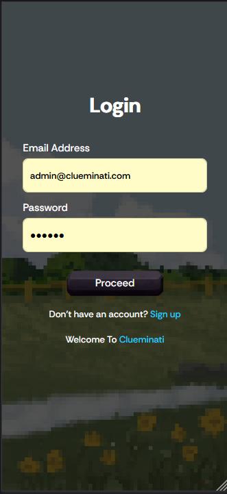
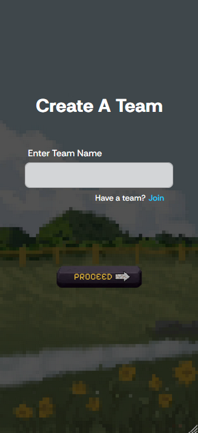
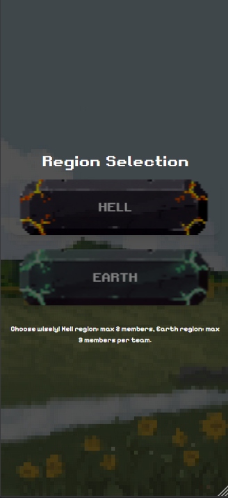
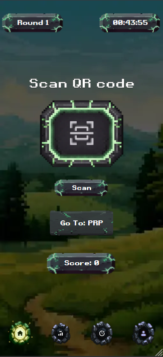
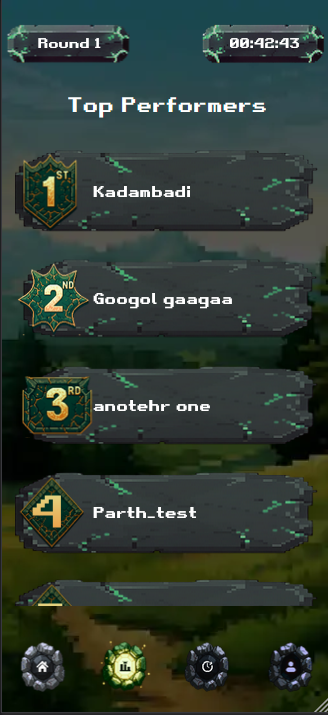
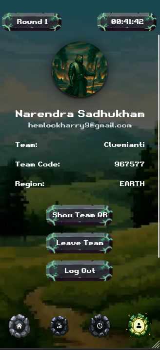
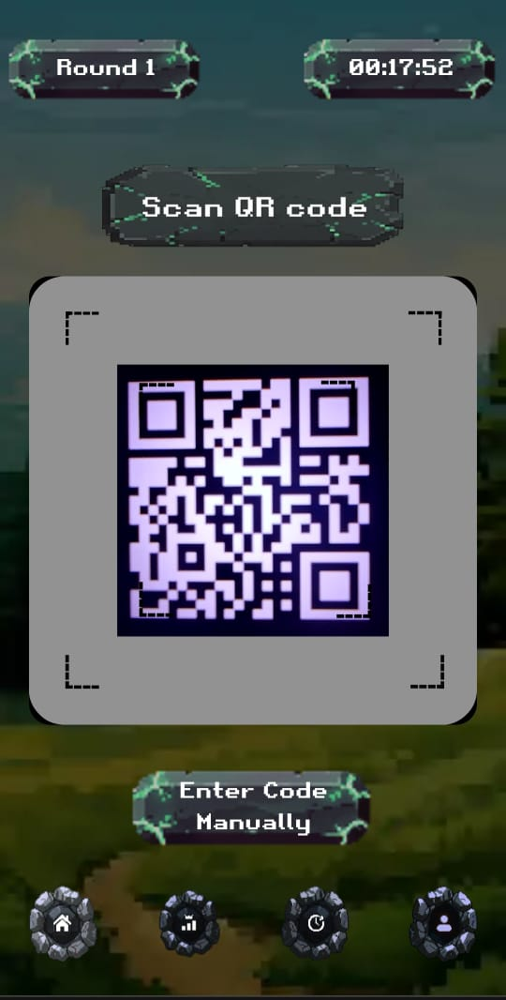
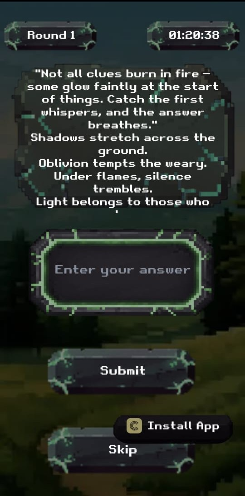
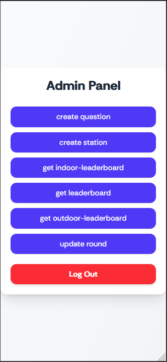

  

<h2 align="center">Clueminati 3.0</h2>

  <strong>Clueminati 3.0</strong> is CodeChef VIT's annual treasure hunt event, back with its 3rd edition in <strong>2025</strong>.
  This web application enables seamless team creation, score tracking, and real-time leaderboard management—ensuring participants enjoy an engaging and competitive experience throughout the event.

<h3>🌐 Deploy</h3>

  <a href="https://clueminati.codechefvit.com" target="_blank" rel="noreferrer">
    https://clueminati.codechefvit.com
  </a>

<h3>⚙️ Tech Stack</h3>
<ul>
  <li><a href="https://nextjs.org" target="_blank" rel="noreferrer">Next.js</a></li>
  <li><a href="https://www.typescriptlang.org" target="_blank" rel="noreferrer">TypeScript</a></li>
  <li><a href="https://tailwindcss.com" target="_blank" rel="noreferrer">Tailwind CSS</a></li>
  <li><a href="https://react-hot-toast.com" target="_blank" rel="noreferrer">React Hot Toast</a></li>
  <li><a href="https://axios-http.com" target="_blank" rel="noreferrer">Axios</a></li>
  <li><a href="https://ui.shadcn.com" target="_blank" rel="noreferrer">Shadcn</a></li>
  <li><a href="https://www.mongodb.com" target="_blank" rel="noreferrer">MongoDB</a></li>
</ul>

<h3>💡 Features</h3>
<ul>
  <li><strong>Home Page</strong> — central hub for navigation and quick access to event features.</li>
  <li><strong>Scanner Page</strong> — scan QR codes to fetch questions during the treasure hunt.</li>
  <li><strong>Questions Page</strong> — view, attempt, and submit answers to event questions.</li>
  <li><strong>Admin Dashboard</strong> — manage teams, monitor scores, and update the leaderboard.</li>
  <li><strong>Team Management</strong> — participants can easily create or join teams.</li>
  <li><strong>Dynamic Leaderboard</strong> — real-time ranking updates for all teams.</li>
  <li><strong>Responsive Design</strong> — optimized for all devices and screen sizes.</li>
</ul>

<h3>🖼 Screenshots</h3>
<table>
  <tr>
    <td align="center">
      
       
Login Page

    </td>
    <td align="center">
      
       
Join Team

    </td>
    <td align="center">
      
       
Create Team

    </td>
  </tr>
  <tr>
    <td align="center">
      
       
Home

    </td>
   <td align="center">
      
       
Home

    </td>
    <td align="center">
      
       
Leaderboard

    </td>
  </tr>
  <tr>
    <td align="center">
      
       
Profile

    </td>
    <td align="center">
      
       
Scanner

    </td>
    <td align="center">
      
       
Questions

    </td>
  </tr>
  <tr>
    <td align="center">
      
       
Admin Dashboard

    </td>
  </tr>
</table>

<h3>🏁 Getting Started</h3>

<ol>
  <li>
    
<strong>Clone the repository</strong>

    <pre><code>git clone -b main https://github.com/CodeChefVIT/clueminati-2025
    clueminati-2025.git
cd clueminati-portal-3.0</code></pre>
  </li>

  <li>
    
<strong>Install dependencies</strong>

    <pre><code>pnpm i</code></pre>
  </li>

  <li>
    
<strong>Set up environment variables</strong>

    <pre><code>cp .env.example .env</code></pre>
    
Update the values in <code>.env</code> (especially your MongoDB connection URI).

  </li>

  <li>
    
<strong>Database setup (MongoDB)</strong>

    
Ensure your <code>MONGODB_URI</code> (or equivalent) points to your MongoDB/Atlas instance. Create any required indexes/seed data if your app provides scripts.

    <!-- If you have scripts, uncomment and customize:
    <pre><code>pnpm db:seed
pnpm db:index</code></pre>
    -->
  </li>

  <li>
    
<strong>Run the development server</strong>

    <pre><code>pnpm dev</code></pre>
  </li>
</ol>

<h3>📝 Notes</h3>
<ul>
  <li>To access admin APIs, set the user role as <code>admin</code> in the database.</li>
  <li>API documentation: <a href="https://documenter.getpostman.com/view/25706513/2sAXqp83bu" target="_blank" rel="noreferrer">Postman Docs</a>.</li>
</ul>

<h3>🚀 Contributors</h3>
<ul>
  <li><a href="https://github.com/kashyap-harshit" target="_blank" rel="noreferrer">Harshit Kashyap Sharma</a><li>
  <li><a href="https://github.com/harsheta-6" target="_blank" rel="noreferrer">Harsheta Bhardwaj</a><li>
  <li><a href="https://github.com/naren06-afk" target="_blank" rel="noreferrer">Narendra Sadhukhan<a><li>
  <li><a href="https://github.com/Rohith-JN" target="_blank" rel="noreferrer">Rohith JN</a><li>
  <li><a href="https://github.com/rupeshhh007" target="_blank" rel="noreferrer">Rupesh Tripathi</a><li>
  <li><a href="https://github.com/Sajith-13" target="_blank" rel="noreferrer">Sajith M</a><li>
  <li><a href="https://github.com/Skywalker-organa" target="_blank" rel="noreferrer">Sanjana Shyamsundar</a><li>
  <li><a href="https://github.com/sofaspawn" target="_blank" rel="noreferrer">Hardik</a><li>
</ul>

<h3>📜 License</h3>

This project is licensed under the <a href="http://badges.mit-license.org" target="_blank" rel="noreferrer">MIT License</a>.

  Made by <a href="https://www.codechefvit.com" target="_blank" rel="noreferrer">CodeChef-VIT</a>

